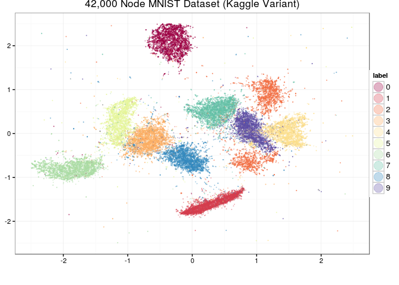
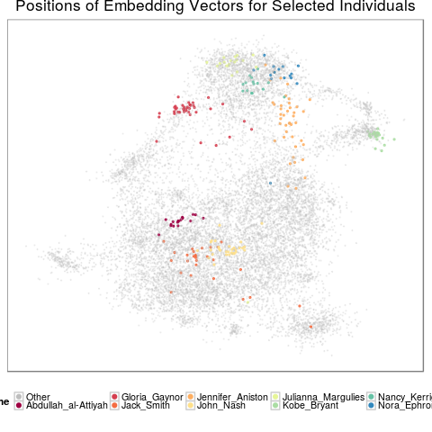
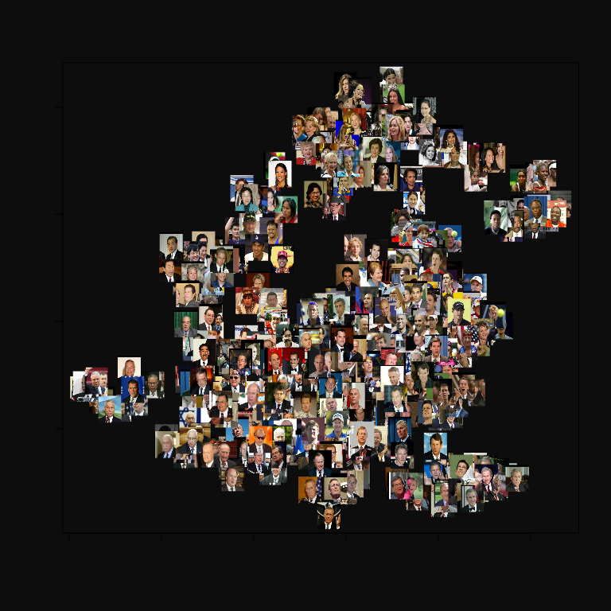
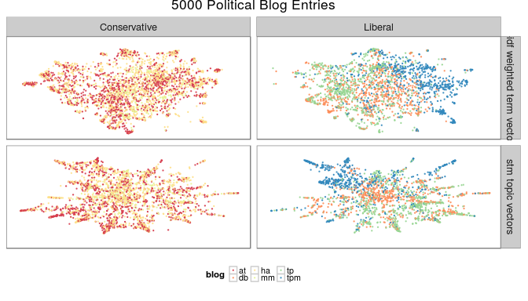
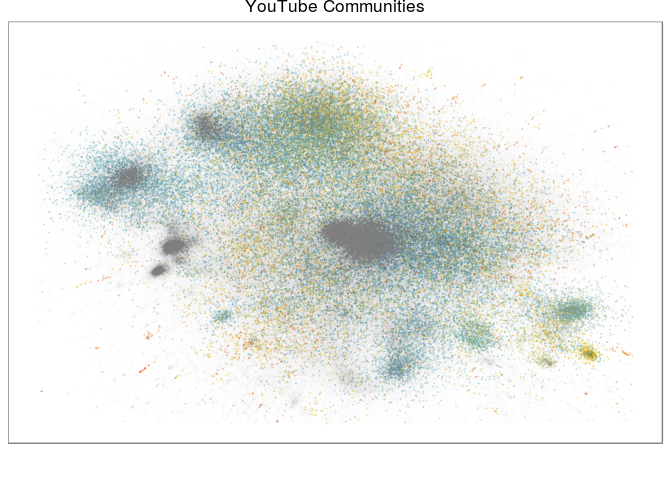

largeVis
================

[](https://travis-ci.org/elbamos/largeVis)[](https://codecov.io/github/elbamos/largeVis?branch=0.1.6) [](https://gitter.im/elbamos/largeVis?utm_source=badge&utm_medium=badge&utm_campaign=pr-badge&utm_content=badge)[](https://ci.appveyor.com/project/elbamos/largeVis)

This is an implementation of the `largeVis` algorithm described in (<https://arxiv.org/abs/1602.00370>). It also incorporates a very fast algorithm for estimating k-nearest neighbors, implemented in C++ with `Rcpp` and `OpenMP`, and for visualizing a map of the manifold in the manner demonstrated by [Andrej Karpathy](http://cs.stanford.edu/people/karpathy/cnnembed/).

#### Project Status & Caveats

-   Support for sparse matrices!
-   Now tested with (dense) matrices &gt; 1 Million rows, and sparse matrices with &gt; 10,000 features.
-   Memory efficiency and performance are excellent. Memory efficiency can be improved further by using utility functions to perform the algorithm in stages. (Explained in the vignette.)
-   Not yet fully tested:
    -   The alternative distance function (*α* = 0).
    -   Transparency in the visualization function.
    -   Multi-color images in the visualization function.
-   I am attempting to replicate the paper's results with larger and larger datasets. This takes time because my hardware is not as powerful as the authors'. If you have any to volunteer, please contact me!

#### To-do's Before Submission to CRAN

-   Demonstrate correctness by visualizing the wiki-doc and wiki-term datasets used in the paper. **Waiting on submission from paper authors so the data can be parsed properly.**
-   Compile more-complete benchmarks from a server. **In progress.**
-   Confirm that the map visualization function works with color images. **DONE**
-   Give Erik and Dirk a few days to comment on the performance.

Vignette
--------

``` r
buildManifolds=TRUE
```

This Vingette provides an overview of the largeVis package.

Introduction
------------

The `largeVis` package offers four functions for visualizing high-dimensional datasets and finding approximate nearest neighbors, based on the `LargeVis` algorithm presented in Tang et al. (2016):

1.  `randomProjectionTreeSearch`, a method for finding approximate nearest neighbors.
2.  `projectKNNs`, which takes as input a weighted nearest-neighbor graph and estimates a projection into a low-dimensional space.
3.  `vis`, which combines `randomProjectionTreeSearch`, `buildEdgeMatrix`, and `projectKNNs`, along with additional code to implement the `LargeVis` algorithm.
4.  `manifoldMap`, which produces a plot for visualizing embeddings of images.

See the [original paper](https://arxiv.org/abs/1602.00370) for a detailed description of the algorithm.

Data Preparation
----------------

For input to `largeVis`, data should be scaled, NA's, Infs and NULL removed, and transposed from the R-standard so that examples are columns and features are rows. Duplicates should be removed as well.

If there are NA's, Infs, or NULLs in the input, `randomProjectionTreeSearch` will definitely fail.

If the numerical range covered by the data is large, this can cause errors in or before the `buildEdgeMatrix` function. This is because the algorithm requires calculating $\\exp(||\\vec{x\_i}, \\vec{x\_j}||^2)$ in the high-dimensional space, which will overflow if the distance between any nearest neighbors exceeds about 26.

If there are duplicates in the input data, while the implementation tries to filter duplicates, it is likely to lead to problems. If the number of duplicates is large, this can cause the random projection tree search to fail. If the number is small, the algorithm may identify a sufficient number of neighbors, but an error may then occur during `buildEdgeMatrix`, or stochastic gradient descent.

Examples
--------




Overview of Functions and Hyperparameters
-----------------------------------------

### `randomProjectionTreeSearch`

This function uses a two-phase algorithm to find approximate nearest neighbors. In the first phase, which is based on [Erik Bernhardsson](http://erikbern.com)'s [Annoy](https://github.com/spotify/annoy) algorithm, `n_trees` trees are formed by recursively dividing the space by hyperplanes until at most `tree_threshold` nodes remain in a branch. A node's candidate nearest neighbors are the union of all nodes with which it shared a leaf on any of the trees. The `largeVis` algorithm adds a second phase, neighborhood exploration, which considers, for each node, whether the candidate neighbors of the node's candidate immediate neighbors are closer. The logic of the algorithm is that a node's neighbors' neighbors are likely to be the node's own neighbors. In each iteration, the closest `K` candidate neighbors for each node are kept.

(Note that this implementation of `largeVis` differs from the approach taken by `Annoy`, in that `Annoy` always uses the number of features as the leaf threshold, where `largeVis` allows this to be an adjustable parameter.)

The authors of Tang et al. (2016) suggest that a single iteration of the second phase is generally sufficient to obtain satisfactory performance.

The chart below illlustrates the trade-off between performance and accuracy for the nearest-neighbor search, using various hyperparameters. The data was produced using the `benchmark.R` script in the `inst/` directory. The test data is the 1-million vector, 128-feature [SIFT Dataset](http://corpus-texmex.irisa.fr/), as per Erik Bernhardsson's [ANN Benchmark](https://github.com/erikbern/ann-benchmarks) github.


The `largeVis` series are labelled by the number of neighbor-exploration iterations.

The difference between `RcppAnnoy` and `RcppAnnoy-Full` is that `Annoy` is designed for the construction of a static tree that can then be queried, while `largeVis` finds nearest neighbors for all nodes at the same time. The times shown for `RcppAnnoy` are the times to fetch neighbors only for the 10000 rows that were used to test. `RcppAnnoy-full`, like `largeVis`, shows the time to fetch neighbors for the entire dataset.

The data confirms the recommendation of the paper authors' concerning the number of iterations of neighborhood exploration: While the first iteration offers a substantial benefit, however it is more efficient to improve accuracy by increase the number of trees or size of the tree threshold than by adding iterations.

If `randomProjectionTreeSearch` fails to find the desired number of neighbors, usually the best result is obtained by increasing the tree threshold. If `randomProjectionTreeSearch` fails with an error that no neighbors were found for some nodes, and the tree threshold is already reasonable, this may be an indication that duplicates remain in the input data.

### `projectKNNs`

This function takes as its input a `Matrix::sparseMatrix`, of connections between nodes. The matrix must be symmetric. A non-zero cell implies that node `i` is a nearest neighbor of node `j`, vice-versa, or both. Non-zero values represent the strength of the connection relative to other nearest neighbors of the two nodes.

The `LargeVis` algorithm, explained in detail in Tang et al. (2016), estimates the embedding by sampling from the identitied nearest-neighbor connections. For each edge, the algorithm also samples `M` non-nearest neighbor negative samples. `M`, along with *γ* and *α*, control the visualization. *α* controls the desired distance between nearest neighbors. *γ* controls the relative strength of the attractive force between nearest neighbors and repulsive force between non-neighbors.

The following grid illustrates the effect of the *α* and *γ* hyperparameters, using the `wiki` dataset which is included with the package:


The additional hyperparameters *ρ* and `min-`*ρ* control the starting and final learning rate for the stochastic gradient descent process.

The algorithm can treat positive edge weights in two different ways. The authors of Tang et al. (2016) suggest that edge weights should be used to generate a weighted sampling. However, the algorithm for taking a weighted sample runs in *O*(*n*log*n*). Alternatively, the edge-weights can be applied to the gradients. This is controlled by the `weight_pos_samples` parameter.

### `vis`

The `vis` function combines `randomProjectionTreeSearch` and `projectKNNs`, along with additional logic for calculating edge weights, to implement the complete `LargeVis` algorithm.

The following chart illustrates the effect of the `M` and `K` parameters, using the `iris` dataset. Each row re-uses the same set of identified `K` neighbors, and initial coordinates.


### `manifoldMap`

The `manifoldMap` function is useful when the examples being clustered are themselves images. Given a coordinate matrix (as generated by `projectKNNs` or `vis`) and an `array` of `N` images, the function samples `n` images and plots them at the coordinates given in the matrix. If the `transparency` parameter is a number between 0 and 1, then the function adds to each image an alpha channel where the value per pixel is proportional to *t**r**a**n**s**p**a**r**e**n**c**y*\* the image content.

The function can plot both color and greyscale images.

#### Example with MNIST Letters

The following code will plot 5000 images sampled from the MNIST dataset at positions generated by `vis`:

``` r
if (exists("trainData")) {
  dim(trainData) <- c(60000, 28, 28)
  set.seed(1974)
  manifoldMap(mnistCoords[,1:2],
      n = 5000,
      scale = 0.003,
      transparency = F,
      images = trainData,
      xlab = "", 
      ylab = "",
      xlim = c(-2, 2),
      ylim = c(-2, 2))
} 
```


The code is disabled by default in this vignette for data size reasons.

#### Example with Faces

The following examples visualize facial-recognition embedding vectors from the [Labelled Faces in the Wild](http://vis-www.cs.umass.edu/lfw/) dataset. The embedding vectors were graciously provided by [Brandon Amos](https://bamos.github.io/) of the [OpenFace](https://cmusatyalab.github.io/openface/) project. Similar vectors may be generated for images using the OpenFace `batch-represent` command.

OpenFace embedding vectors encode an image in such a way that the embeddings for multiple images of the same person should be similar. This is illustrated on the first plot below, which highlights the locations of the embedding vectors for images of 10 selected individuals. (The 10 were selected on the basis that there are a large number of images of each in the dataset, and the author would reognize them.)



The function of `manifoldMap` is illustrated in the following plot, which places 300 images from the dataset at the locations given by the `largeVis` map.

The plot is disabled by default because it requires obtaining the face images directly from [Labelled Faces in the Wild](http://vis-www.cs.umass.edu/lfw/).



Support for Sparse Matrices
---------------------------

`largeVis` supports sparse matrices. Besides facilitating very large datasets, this makes it practicable to visualize term-document-matrices.

For example, the following plot visualizes a corpus of 5000 political blog entries, as included with the `stm` package. The first row visualizes the blog entries as tf-idf weighted term vectors; the second, as topic vectors.

    #> Warning: Removed 56 rows containing missing values (geom_point).



This facilitates evaluation of the effectiveness of a topic model.

Visualizing Graphs
------------------

The `largeVis` visualization algorithm can be used to visualize ordinary graphs. The included `wiki` dataset is an example.

The following code illustrates how to import and visualize a graph using the YouTube-communities dataset available [here](https://snap.stanford.edu/data/com-Youtube.html).

``` r
pathToGraphFile <- 
  "/mnt/hfsshare/DATASETS/YouTubeCommunities/com-youtube.ungraph.txt"
pathToCommunities <- 
  "/mnt/hfsshare/DATASETS/YouTubeCommunities/com-youtube.top5000.cmty.txt"

youtube <- readr::read_tsv(pathToGraphFile, skip=4, col_names=FALSE)
youtube <- as.matrix(youtube)
youtube <- Matrix::sparseMatrix(i = youtube[, 1],
                                j = youtube[, 2],
                                x = rep(1, nrow(youtube)), 
                                dims = c(max(youtube), max(youtube)))
youtube <- youtube + t(youtube)
communities <- readr::read_lines(pathToCommunities)
communities <- lapply(communities, 
                      FUN = function(x) as.numeric(unlist(strsplit(x, "\t"))))
community_assignments <- rep(0, 
                             nrow(youtube))
for (i in 1:length(communities)) community_assignments[communities[[i]]] <- i

youTube_coordinates <- projectKNNs(youtube)
youTube_coordinates <- data.frame(scale(t(youTube_coordinates)))
colnames(youTube_coordinates) <- c("x", "y")
youTube_coordinates$community <- factor(community_assignments)
youTube_coordinates$alpha <- factor(ifelse(youTube_coordinates$community == 0, 0.05, 0.2))
```



``` r
pathToGraphFile <- 
  "/mnt/hfsshare/DATASETS/livejournal/com-lj.ungraph.txt"
pathToCommunities <- 
  "/mnt/hfsshare/DATASETS/livejournal/com-lj.top5000.cmty.txt"

livejournal <- readr::read_tsv(pathToGraphFile, skip=4, col_names=FALSE)
livejournal <- as.matrix(livejournal) + 1
livejournal <- Matrix::sparseMatrix(i = livejournal[, 1],
                                j = livejournal[, 2],
                                x = rep(1, nrow(livejournal)), 
                                dims = c(max(livejournal), max(livejournal)))
livejournal <- livejournal + t(livejournal)
communities <- readr::read_lines(pathToCommunities)
communities <- lapply(communities, 
                      FUN = function(x) as.numeric(unlist(strsplit(x, "\t"))) + 1)
community_assignments <- rep(0, 
                             nrow(livejournal))
for (i in 1:length(communities)) community_assignments[communities[[i]]] <- i

todelete <- which(rowSums(livejournal) == 0)
livejournal <- livejournal[- todelete, - todelete]
community_assignments <- community_assignments[- todelete]

livejournal_coordinates <- projectKNNs(livejournal)
livejournalyouTube_coordinates <- data.frame(scale(t(youTube_coordinates)))
colnames(livejournal_coordinates) <- c("x", "y")
livejournal_coordinates$community <- factor(community_assignments)
livejournal_coordinates$alpha <- factor(ifelse(livejournal_coordinates$community == 0, 0.05, 0.2))
```

Distance Methods
----------------

The original `LargeVis` paper used Euclidean distances exclusively. The `largeVis` package offers a choice among Euclidean and Cosine distance measures.

Memory Consumption
------------------

The algorithm is necessarily memory-intensive for large datasets. `neighborsToVectors`, `distance`, and `buildEdgeMatrix` are available as separate functions to facilitate memory-efficient handling of large datasets, because the high-dimensional dataset is not needed after distances have been calculated. In this case, the workflow is:

``` r
neighbors <- randomProjectionTreeSearch(largeDataset)
neighborIndices <- neighborsToVectors(neighbors)
rm(neighbors)
distances <- distance(neighborIndices$i, 
                      neighborIndices$j,
                      largeDataset)
rm(largeDataset)
wij <- buildEdgeMatrix(i = neighborIndices$i, 
                       j = neighborIndices$j, 
                       d = distances)
rm(distances, neighborIndices)
coords <- projectKNNs(wij$wij)
```

In testing, this method reduced peak RAM requirements by more than 70%.

Bibliography
------------

Tang, Jian, Jingzhou Liu, Ming Zhang, and Qiaozhu Mei. 2016. “Visualizing Large-Scale and High-Dimensional Data.” In *Proceedings of the 25th International Conference on World Wide Web*, 287–97. International World Wide Web Conferences Steering Committee.
