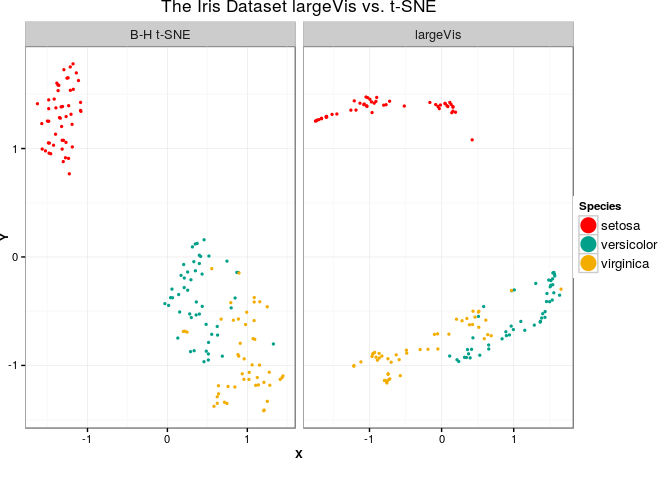

largeVis
================

This is an implementation of the `largeVis` algorithm described in (<https://arxiv.org/abs/1602.00370>). It also incorporates code for a very fast algorithm for estimating k-nearest neighbors.

The inner loops for nearest-neighbor search and gradient descent are implemented in C++ using `Rcpp` and `RcppArmadillo`. (If you get an error that a `NULL value passed as symbol address` this relates to `Rcpp` and please open an issue here.)

#### Project Status & Caveats

-   This project is under heavy development. It is likely that there are still bugs in the math.
-   Currently, the code is tested to perform correctly with small datasets.
-   Performance in the neighborhood exploration phase is unusually slow; I am working on tracing the cause.

#### Examples:

``` r
library(largeVis,quietly=T)
data(iris)
dat <- as.matrix(iris[,1:4])
dat <- scale(dat)
dupes = which(duplicated(dat))
dat <- dat[-dupes,]
visObject <- largeVis(dat, pca.first = F, 
                   max.iter = 20, sgd.batches = 800000, 
                   K = 10,  gamma = 2, rho = 1, M = 40, alpha = 20,verbose=F)
```

    ## Loading required package: ggplot2


