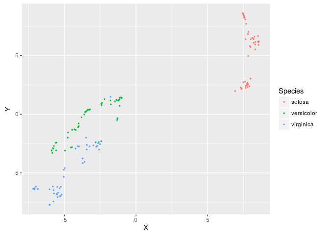

largeVis
================

This is an implementation of the `largeVis` algorithm described in (<https://arxiv.org/abs/1602.00370>). It also incorporates code for a very fast algorithm for estimating k-nearest neighbors.

The inner loops for nearest-neighbor search and gradient descent are implemented in C++ using `Rcpp` and `RcppArmadillo`. (If you get an error that a `NULL value passed as symbol address` this relates to `Rcpp` and please open an issue here.)

This has been tested and confirmed to work in many circumstances. More extensive documentation and examples are being prepared.

Please note that this package is under development (the paper is only two weeks old) so it is likely that implementation bugs will be found and changes made to the api.

Examples:
---------

``` r
library(largeVis)
library(ggplot2)
data(iris)
dat <- as.matrix(iris[,1:4])
coords <- largeVis(dat, pca.first = F, 
                   max.iter = 5, sgd.batches = 1000000, 
                   gamma = 3, K = 40, M = 5, rho = 2,min.rho = 0, verbose = FALSE)
```

    ## Called from: randomProjectionTreeSearch(shrunken.x, n.trees = n.trees, tree.threshold = tree.threshold, 
    ##     K = K, max.iter = max.iter, verbose = verbose)
    ## debug at /mnt/hfsshare/opensource/largevis/R/projectionTreeSearch.R#47: cat("Neighbors found!\n")
    ## Neighbors found!
    ## debug at /mnt/hfsshare/opensource/largevis/R/projectionTreeSearch.R#48: return(outputKnns)

``` r
coords <- data.frame(coords$coords)
colnames(coords) <- c("X", "Y")
coords$Species <- iris$Species
ggplot(coords, aes(x = X, y = Y, color = Species)) + geom_point(size = 0.5)
```

<!-- -->
